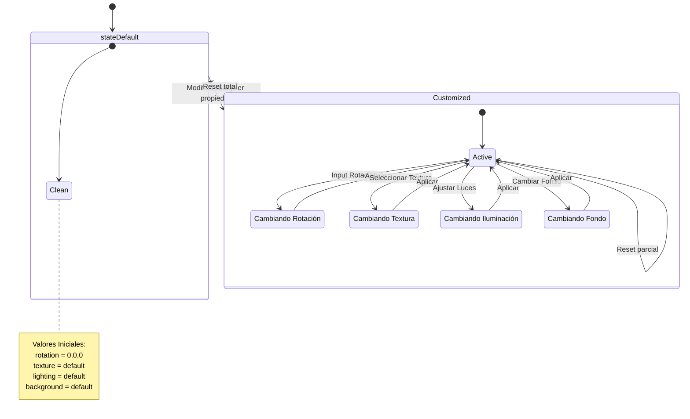
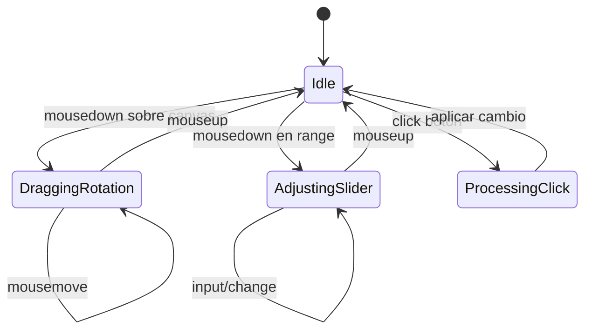
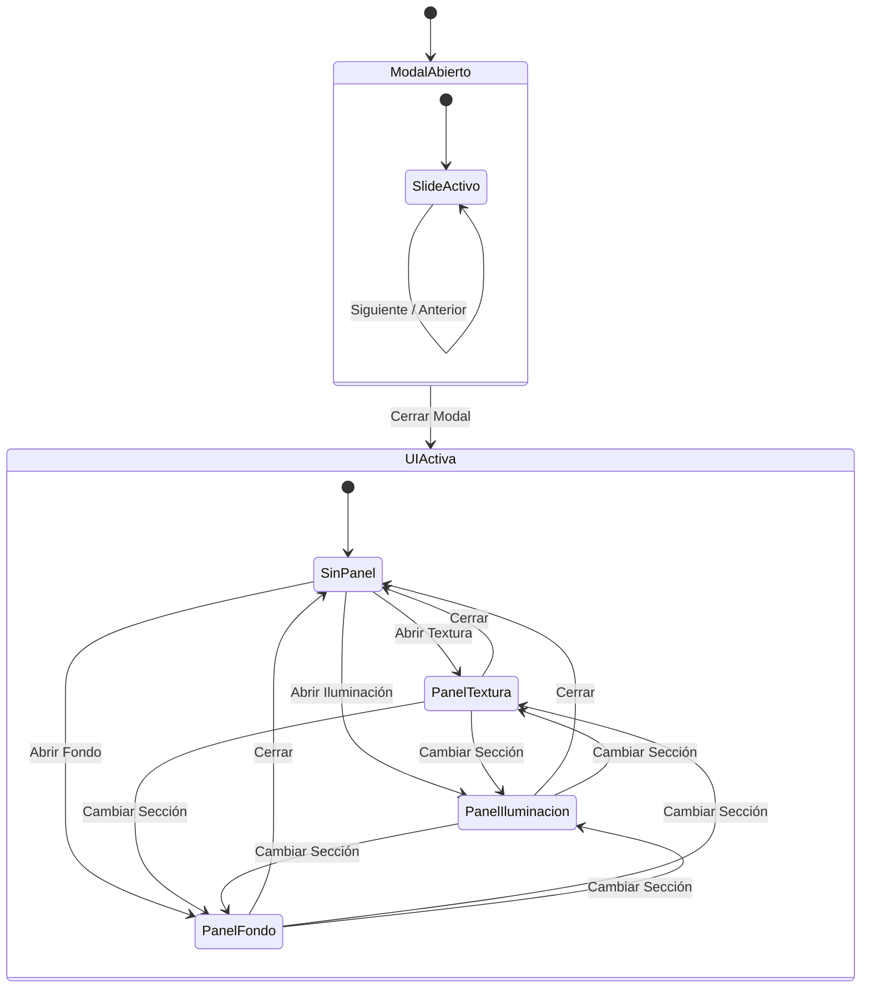
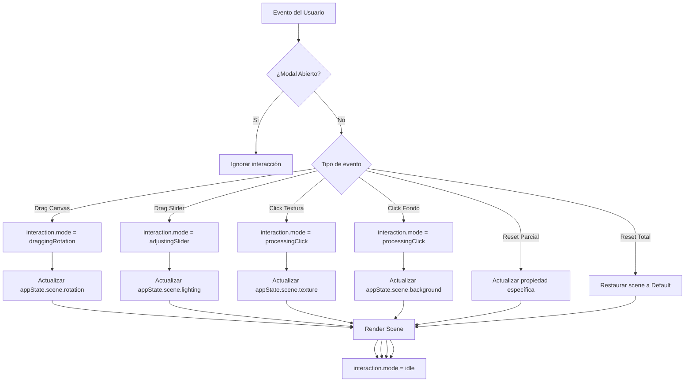

El objetivo es crear una experiencia web donde el usuario pueda rotar un elemento 3D (a elección). La rotación puede ser dada en cualquier dirección del plano cartesiano. Aparte tener dos secciones; una para modificar la textura del elemento 3D, y otra para cambiar la iluminación del entorno. 

parte se nos permite añadir mas funcionalidades de preferencia. Por lo tanto tengo pensado agregar los siguientes:
- Una sección para cambiar el fondo
- Barras de rango arrastrables para modificar variables de las iluminaciones
- Botón para restablecer configuraciones de iluminación
- Botón para restablecer rotación del objeto 3D
- Modal tutorial de como usar esta experiencia
Aclarar que esto será implementado una vez el objetivo principal descrito en el primer párrafo es cumplido.

---

## Boceto de experiencia 3D


---
## Arquitectura del proyecto:

El proyecto será desarrollado netamente en tecnologías vanilla, como HTML, CSS y Javascript sin usar frameworks y únicamente usando la librería de ThreeJS para el cargue de la escena 3D y el objeto contenido por esta.

### Tecnologías a usar
`HTML`
`CSS`
`Javascript`
`ThreeJS`

### Árbol de ficheros

```
index.html
styles/
└── main.css                   <-- Contenedor de estilos
scripts/
├── modules/
│   ├── viewer.js              <-- Toda la configuración de Three.js (Escena, Cámara, Render)
│   ├── ui-controls.js         <-- Lógica de botones, range bars y cambios de texturas
│   └── modal.js               <-- Lógica del tutorial (abrir, cerrar, cambiar slides)
└── main.js                    <-- Orquestador JS
assets/
├── data/                      <-- Se guardan los json 
└── models/                    <-- Aquí guardas tu 'modelo.glb' o 'escena.gltf'
```
---
## ¿Cómo va a funcionar?

Primeramente, es ideal tener un manejador de estados. De este modo las responsabilidades dentro del funcionamiento de la experiencia estarán divididas facilitando tanto su integración en el código, como el escalar esta solución (en este caso no buscaremos escalar, ya que se trata de una prueba técnica). Por lo que se propone los siguientes estados (las propiedades pueden cambiar a medida de que se vaya implementando la solución).

1. Estado de escena 3D
2. Estado de interacción (rotación,  cambio de luz, cambio de materiales)
3. Estado UI

Por lo tanto alojaríamos lo siguiente en el fichero `main.js` 

```javascript
const appState = {
  scene: {
    rotation: { x: 0, y: 0, z: 0 },
    texture: "default",
    lighting: {
      intensity: 1,
      color: "#ffffff"
    },
    background: "default"
  },

  interaction: {
	mode: "idle"
	// "draggingRotation" | "adjustingSlider" | "processingClick"
  }

  ui: {
    modal: {
      isOpen: true,
      currentSlide: 0
    },
    activePanel: null // "texture" | "lighting" | "background" | null
  }
};
```

Bien, ¿Y qué significa cada dominio?

### Scene 
Representa el estado renderizable.
_Regla importante_:
> Viewer.js solo lee de aquí. No decide cosas por sí mismo. 

Si el usuario cambia la intensidad de una iluminación:
- UI manda a actualizar `scene.lighting.intensity`
- Viewer re-renderiza



- **stateDefault**
  Todo en valores base.
- **Customized**
  Al menos una propiedad ≠ default.
- Dentro de `Customized`:
	- No importa cuántas propiedades estén modificadas.
	- Cada cambio mantiene el estado dentro de `Customized`.
	- Solo un `Reset total` devuelve a `Default`.

- Con este modelo:
	- `viewer.js` solo renderiza según `scene`.
	- `ui-controls.js` modifica `scene`.
	- `main.js` puede evaluar si está en `Default` o `Customized`.
  Eso es separación limpia.

### Interaction
Esto evita lógica implícita.
Ejemplo:
- Mientras `isDragging = true`, ignoras ciertos eventos.
- `activeControl` te permite saber qué está modificando el usuario.

Sin esto, terminaremos deduciendo el estado desde eventos del DOM.



- **Idle**
  No hay interacción activa.
- **DraggingRotation**
  El usuario está arrastrando el objeto.
  Mientras esté aquí:
	- Se debe bloquear otras interacciones conflictivas.
- **AdjustingSlider**
  Usuario arrastrando un control de iluminación.
  Mientras esté aquí:
	- Rotación no debería activarse.
	- No se debería cambiar el panel (textura | Iluminación | Fondo).
- **ProcessingClick**
  Evento puntual (textura, fondo, reset).  
  No es persistente.
  Los únicos estados que persisten mientras ocurre algo son:
	- DraggingRotation
	- AdjustingLighting

El resto es evento puntual.

### UI
La UI no debería depender del estado de la escena directamente.
Ejemplo:
- El modal puede estar abierto aunque la escena esté lista.
- Un panel puede estar activo aunque no haya cambios en el objeto.

Separarlo evita dependencias cruzadas.



- **ModalAbierto**
	- Bloquea todo lo demás.
	- Tiene su propia navegación interna (slides).
- **UIActiva**
  Solo existe cuando el modal está cerrado.
  Dentro de UIActiva:
	- Nunca hay más de un panel activo.
	- Siempre hay exactamente uno de estos:
	    - `SinPanel`
	    - `PanelTextura`
	    - `PanelIluminacion`
	    - `PanelFondo`
  Eso eliminará estados inválidos.
  Si el modal está abierto:
	- No debería haber panel activo.
	- No debería haber interacción con sliders.

### El flujo de interacción:



1. Todo empieza en un evento.
2. Se valida si el modal bloquea interacción.
3. Se identifica el tipo de evento.
4. Se actualiza `appState.scene`.
5. Se dispara render.
6. Interaction vuelve a `idle`.

---
## Modelo de Render

Por practicas de Three js, se ha decidido implementar `Render loop Constante + lectura directa` ya que de este modo no llamaremos  el render de manera manual, solamente actualizaremos el estado y el loop se refleja. Aparte al ser un proyecto vanilla, no existe reactividad automática.

---

## Integración con la arquitectura de ficheros

Basado en el funcionamiento de la experiencia teniendo en cuenta los estados de esta, se decidio integrar lo anterior de la siguiente manera:

- `ui-controls.js`
    - Detecta evento
    - Cambia `appState`
    - Cambia `interaction.mode`
- `viewer.js`
    - Observa `appState.scene`
    - Renderiza en loop
- `main.js`
    - Inicializa estado
    - Conecta módulos

---

## Decisiones de Diseño UI

### Tipografía

Se optó por utilizar fuentes no serif en todo el proyecto por las siguientes razones:

- **Legibilidad en pantallas**: Las fuentes sans-serif ofrecen mayor claridad y facilidad de lectura en dispositivos digitales, especialmente en tamaños pequeños de interfaz.
- **Estética moderna**: Este tipo de fuentes se alinea con el diseño visual sought-after, transmitiendo una sensación más limpia y profesional.
- **Compatibilidad multiplataforma**: La familia de fuentes definida garantiza una apariencia consistente en diferentes sistemas operativos y dispositivos.

La implementación se encuentra en `styles/base/reset.css` con la siguiente configuración:

```css
font-family: -apple-system, BlinkMacSystemFont, 'SF Pro Text', 'Segoe UI', Roboto, Helvetica, Arial, sans-serif;
```

Esta configuración prioriza la estetica y modernidad. Lo cual aporta a una visual elegante y de vanguardia.

### Layout del Panel de Control (Dock Flotante)

Se optó por posicionar el panel de control en la parte inferior de la pantalla como un dock flotante, inspirado en el diseño de macOS, por las siguientes razones:

- **Ergonomía**: El usuario puede alcanzar fácilmente los controles con el pulgar en dispositivos móviles, mientras que en escritorio se mantiene cerca de la zona de interacción natural.
- **Espacios laterales**: El dock no ocupa todo el ancho de la pantalla, dejando márgenes a los lados que mejoran la sensación de flotabilidad y permiten ver más del objeto 3D.
- **Diseño limpio**: Al estar separado del borde de la pantalla, el dock parece levitar, creando una jerarquía visual donde el objeto 3D es el protagonista absoluto.

La implementación se encuentra en `styles/layout/menu-container.css`:

```css
#dock-panel {
    position: fixed;
    bottom: 12px;
    left: 50%;
    transform: translateX(-50%);
    width: calc(100% - 80px);
    max-width: 600px;
    border-radius: 24px;
}
```

### Glassmorphism (Efecto Vidrio)

Se implementó el efecto glassmorphism en todos los elementos flotantes de la interfaz (header, dock, botones, sliders) por las siguientes razones:

- **Profundidad visual**: El efecto de desenfoque (blur) detrás de los elementos crea una sensación de profundidad y espacio, haciendo que la interfaz no quite protagonismo al objeto 3D.
- **Transparencia elegante**: Permite ver parcialmente el entorno 3D a través de los controles, manteniendo la conexión visual entre el modelo y la interfaz.
- **Estética moderna**: Este efecto es una tendencia consolidada en diseño de interfaces que transmite innovación y sofisticación.

La implementación hace uso de `backdrop-filter` con valores elevados de blur y saturación para un efecto más pronunciado:

```css
backdrop-filter: blur(40px) saturate(180%);
-webkit-backdrop-filter: blur(40px) saturate(180%);
```

Se complementa con bordes translúcidos y sombras sutiles que mejoran la definición de los elementos flotantes.

### Sistema de Pestañas

El panel de control se organiza mediante un sistema de pestañas (Texturas, Iluminación, Fondo) por las siguientes razones:

- **Organización clara**: Separa las diferentes categorías de personalización en secciones lógicas y diferenciadas.
- **Ahorro de espacio**: En lugar de mostrar todos los controles simultáneamente, las pestañas permiten tener una interfaz compacta sin sacrificar funcionalidad.
- **Navegación intuitiva**: El usuario puede alternar rápidamente entre categorías con un solo clic.

Cada pestaña contiene:
- **Swatches visuales**: Botones circulares o redondeados que muestran una previsualización del color/textura a seleccionar.
- **Sliders de control**: Barras de rango horizontales para ajustes finos de propiedades cuantitativas.

### Rotación Automática del Objeto 3D

El objeto 3D cuenta con rotación automática sobre su eje vertical cuando no hay interacción activa, por las siguientes razones:

- **Presentación dinámica**: El objeto siempre está en movimiento, lo que llama la atención del usuario y muestra diferentes ángulos sin necesidad de interacción.
- **feedback visual inmediato**: Al iniciar una interacción (arrastre), la rotación se detiene permitiendo al usuario examinar el objeto desde cualquier ángulo.
- **Retorno automático**: Cuando el usuario deja de interactuar, la rotación vuelve a activarse después de un breve período, manteniendo la experiencia viva.

La implementación detecta el modo de interacción mediante `appState.interaction.mode`:
- `idle`: Rotación automática activa
- `draggingRotation`: Rotación manual del usuario
- `adjustingSlider` / `processingClick`: Otras interacciones
